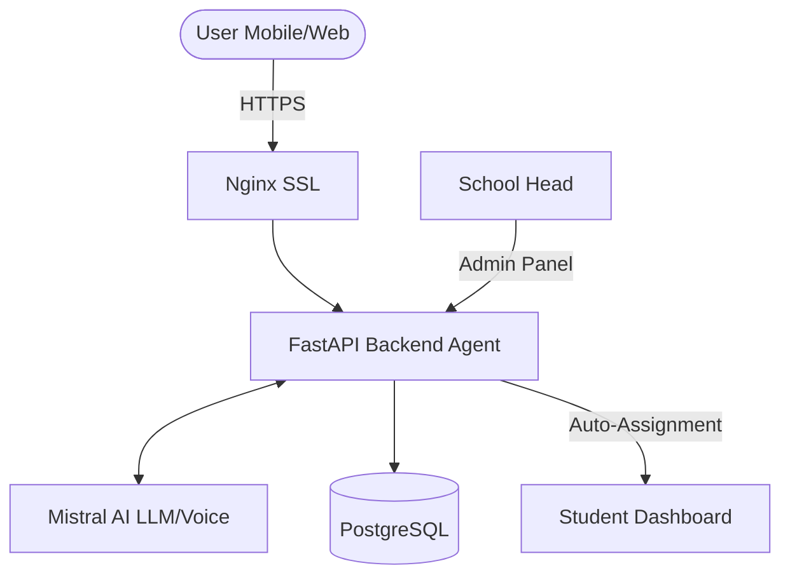

# Mizan — The Autonomous Student Wellbeing Agent
### 🏷️ GIEW 2026: Wellness & Agent Challenge Submission
**Deadline:** April 14, 2026 | **Team:** Mizan Team

> **Mission**: Transforming student stress into focused serenity through a proactive, agentic AI companion.

---

## 🚀 Live Demo & Access

Mizan is fully deployed and ready for evaluation. You can access the different interfaces below:

*   **Mobile PWA (Primary User Hub):** [https://mizanm.mohamededderyouch.me/](https://mizanm.mohamededderyouch.me/)
*   **Web Dashboard:** [https://mizan.mohamededderyouch.me/](https://mizan.mohamededderyouch.me/)
*   **API Documentation:** [https://api.mohamededderyouch.me/docs](https://api.mohamededderyouch.me/docs)

### 🔑 Credentials for Evaluation
| Role | Email | Password |
| :--- | :--- | :--- |
| **Student** | `mohamededderyouch5@gmail.com` | `Simosimo1` |
| **Admin (School Head)** | `admin@mizanmail.local` | `Admin123!` |

---

## 🎯 The Problem
Modern students are overwhelmed by a fragmented digital life. Between complex schedules, high-pressure exams, and mental health challenges, they don't need another static organizer. They need an **Agentic Partner** that senses their state and intervenes proactively.

## 🤖 The Mizan Agent (Agentic Core)
Mizan is a **Sense-Think-Decide-Act** autonomous agent built on the Mistral AI ecosystem. Unlike classic chatbots, Mizan operates as an orchestrator that manages student life in the background.

### 1. SENSE: Multi-Modal Context
Mizan monitors the student's digital twin:
*   **Wellbeing Pulse**: Daily morning/evening rituals (Mood, Sleep, Stress levels).
*   **Academic Pressure**: Real-time synchronization of schedules, exams, and project milestones.

### 2. THINK: Reasoning with Mistral AI
Using a **ReAct (Reason + Action) Planner**, Mizan reflects on the unified context:
> *"The student hasn't logged a revision session for the exam tomorrow and reported high stress this morning. I should propose a 'Stabilization Mode' to reduce anxiety before suggesting a micro-sprint."*

### 3. DECIDE & ACT: Proactive Interventions
Mizan doesn't just reply; it takes system-level actions:
*   **PROPOSE_MODE_SWITCH**: Changes the app theme and focus (REVISION, EXAMEN, REPOS).
*   **CREATE_TASK**: Generates "Adaptive Win" tasks based on current cognitive load.
*   **AGENT_SYNC**: Automatically clones class-wide academic content to the student's personal dashboard when the School Head updates the institution data.

---

## 🏗️ Technical Architecture

Mizan is built for production stability and premium user experience:

*   **Brain:** Mistral AI (Mistral-Large for reasoning, Voxtral for Real-time Voice STT/TTS).
*   **Backend:** FastAPI (Python 3.12) with asynchronous SQLAlchemy and WebSocket support.
*   **Frontends:** Next.js 14 (App Router) with Shadcn UI and Framer Motion.
*   **Infrastructure:** Orchestrated via Docker Compose, deployed on AWS EC2 with Nginx reverse proxy and SSL (Certbot).



---

## 🛠️ How to Run Locally

### 1. Prerequisites
*   Docker & Docker Compose
*   Mistral AI API Key

### 2. Setup
```bash
# Clone the repository
git clone https://github.com/simoderyouch/Mizan.git
cd Mizan

# Configure Environment
cp .env.compose.example .env.compose
# Edit .env.compose and set your MISTRAL_API_KEY
```

### 3. Launch
```bash
docker compose --env-file .env.compose up -d --build
```
*   **Frontend**: `http://localhost:3000`
*   **Backend**: `http://localhost:8000`

---

## 🌟 Features Breakdown
*   **Autonomous Rituals**: Voice-controlled Morning/Evening check-ins that extract actionable insights.
*   **Focus Modes**: Adaptive UI environments (Revision, Exam, Reset) to manage cognitive fatigue.
*   **Institution Dashboard**: Managed by School Heads to ensure all students receive synchronized academic updates instantly.
*   **Digital Sanctuary Design**: A premium, editorial-style interface designed to calm rather than distract.

---
*Created for the GIEW 2026 Wellness & Agent Challenge.*
