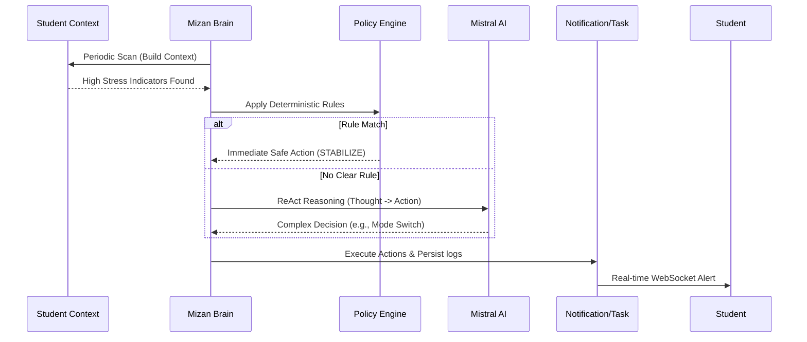

# Mizan — The Intelligent Student Guardian

Mizan is a premium, AI-driven student wellbeing and productivity ecosystem. Designed as a **"Digital Sanctuary"**, it balances academic performance with mental health through an autonomous guardian agent that monitors, reasons, and intervenes to protect students from burnout and academic crises.

---

## 🏛️ System Architecture

Mizan is built on a distributed, low-latency architecture:

### 1. The Mizan Brain (Backend API)
*   **Core**: FastAPI with Python 3.10+, utilizing asynchronous patterns for high-concurrency operations.
*   **Intelligence**: Mistral AI API integration for context-aware reasoning and natural language processing.
*   **Persistence**: PostgreSQL (via Aiven) with SQLAlchemy 2.0 (Async) and Alembic for schema migrations.
*   **Real-time Layer**: WebSocket-based notification delivery system with a REST fallback for history.
*   **Scheduler**: Background worker system (`scheduler_service.py`) running periodic scans and maintenance.

### 2. Digital Sanctuary (User Surfaces)
*   **Web Portal**: Next.js 14 application using the App Router, Shadcn UI, and Framer Motion for smooth, editorial-style transitions.
*   **Mobile PWA**: Specialized mobile build focusing on check-ins, mood tracking, and quick access to AI-generated resources.
*   **Admin Command Center**: Dedicated interface for class-wide event management, student cohort monitoring, and scenario triggering.

---

## 🧠 The Mizan Decision Engine

The Mizan agent operates as a multi-stage reasoning system, ensuring every intervention is both safe and intelligent.

### Multi-Agent Interaction Flow
1.  **Watcher (Scheduler)**: Triggers scans every 5 minutes or on specific events (check-ins, metadata updates).
2.  **Context Builder**: Synthesizes a 360-degree view of the student:
    *   **Academic Pressure**: Upcoming exams (days_until), project deadlines, and course load density.
    *   **Wellbeing Pulse**: Mood scores, sleep hours, and consecutive low-energy days.
    *   **Active Intent**: Currently running "Modes" (Revision, Project, Rest) and progress towards personal goals.
3.  **Policy Layer (The Safeguard)**: Evaluates the context against deterministic rules to handle critical shortcuts (e.g., immediate burnout danger or major exam changes).
4.  **Orchestrator (The Thinker)**: If the policy allows, a **ReAct reasoning loop** uses Mistral AI to evaluate the "unspoken" needs of the student and decide on nuanced interventions.
5.  **Intervention Engine (The Actor)**: Finalizes the choice into one of 7 allowed actions (Notification, Task, Mode Switch, Contract, Resource Nudge, etc.).

---

## 💬 Interactive Wellbeing & Dialogue

Mizan isn't just a monitor; it's a companion. The interaction layer is designed to be deeply personal and accessible.

### 🧘 Wellbeing Rituals (Check-ins)
*   **Dual-Mode Interaction**: Students can complete rituals via structured QCM or natural dialogue (Text/Voice).
*   **Adaptive Q&A**: Mizan generates 3-8 personalized questions based on the student's current stressors (e.g., "How are you feeling about tomorrow's math exam?").
*   **Structured Reports**: Every check-in triggers an AI analysis that extracts `mood_score`, `sleep_hours`, and `executive_summary`, resulting in a detailed action plan.

### 🎙️ Voice Intelligence & Chat
*   **Empathetic Coaching**: A real-time chat interface where Mizan provides emotional support and academic triage using the student's full context.
*   **Mistral Voice Integration**: 
    - **STT (Speech-to-Text)**: High-accuracy transcription of student reflections.
    - **TTS (Text-to-Speech)**: Mizan responds with a calming, synthetic voice to reduce screen fatigue.
    - **Real-time WebSockets**: Low-latency streaming of audio and transcripts for a fluid conversational experience.

---

## 🔄 The Life of an Intervention

---

## 📂 Core Data Entities

*   **Student**: Linked to a Class, Promotion, and Filiere. Maintains personal mood history.
*   **AgentRun / AgentDecision**: Complete audit log of why the AI made a specific decision, including its "thoughts" and confidence score.
*   **AgentActionContract**: Flexible AI-Student agreements describing behavioral commitments.
*   **Checkin (Morning/Evening)**: The primary input for the Wellbeing Pulse (Mood, Sleep, Reflections).
*   **ModeSession**: Tracks focus time (Revision, Project, Sport) to evaluate discipline vs. fatigue.

---

## 🛠️ Local Setup & Development

### Backend
1.  **Env**: Set `DATABASE_URL`, `MISTRAL_API_KEY`, and `SECRET_KEY`.
2.  **Install**: `pip install -r requirements.txt`
3.  **Migrate**: `alembic upgrade head`
4.  **Run**: `uvicorn main:app --reload`

### Frontend(s)
1.  **Env**: Set `NEXT_PUBLIC_API_URL` and `NEXT_PUBLIC_WS_URL`.
2.  **Install**: `npm install && npm run dev`

### Deployment
- For all-in-one jury deployment using Docker Compose on AWS/EC2, follow `DEPLOYMENT_README.md`.
- Quick start:
  1. `cp .env.compose.example .env.compose`
  2. Set required secrets/URLs in `.env.compose`
  3. `docker compose --env-file .env.compose up -d --build`

---

## 🧪 Testing & Scenarios
Mizan includes a **Scenario Lab** (`/agent/scenarios`) for real-time validation. 
You can simulate:
*   **High Stress Overdue Spiral**: Forces the agent to manage a student falling behind multiple projects.
*   **Burnout Imminent**: Triggers a high-priority stabilization protocol.
*   **After Lunch Reset**: Suggests focus modes or breaks during energy-dip hours.

Check `mizan-backend/app/api/v1/routes/agent.py` for manual test triggers and run audit endpoints.
