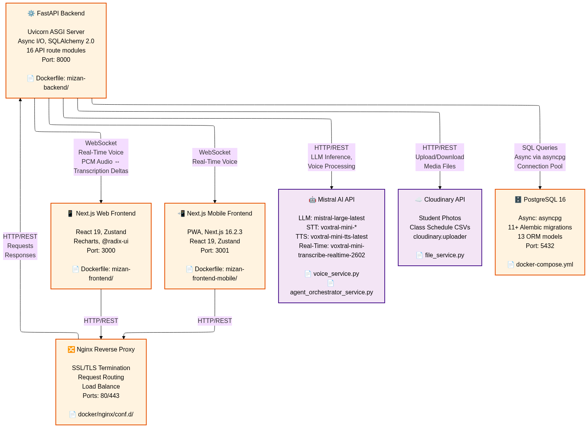
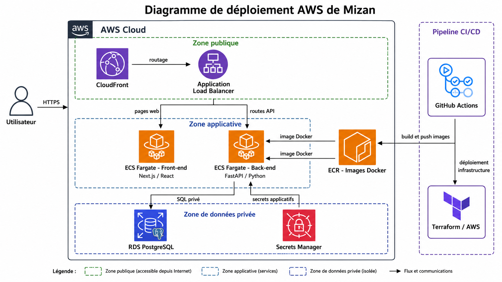
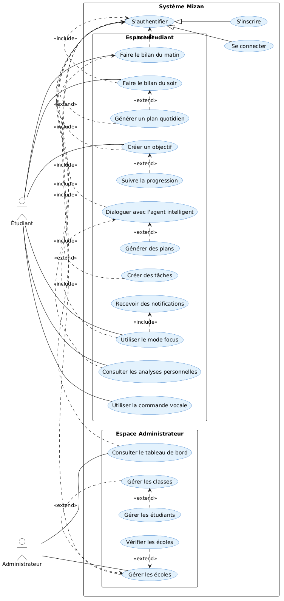
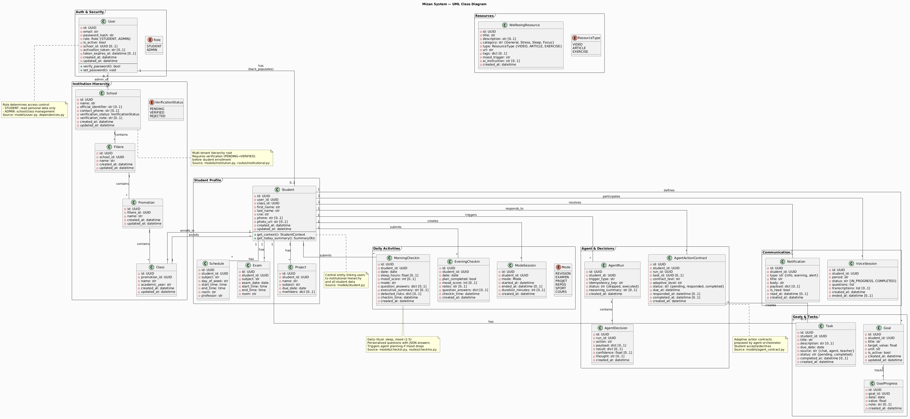
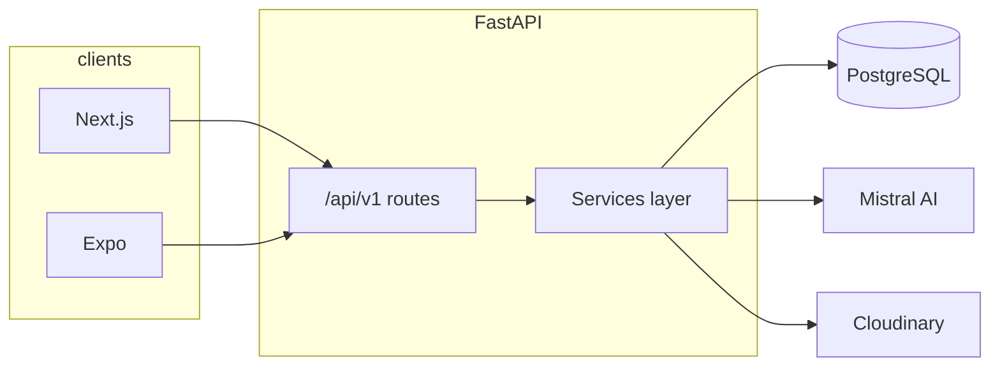
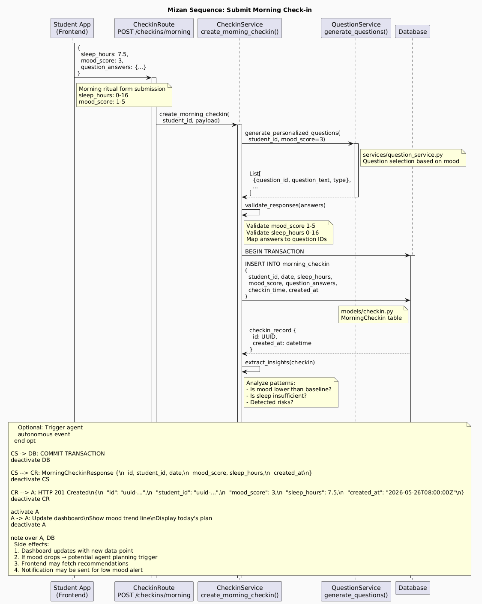
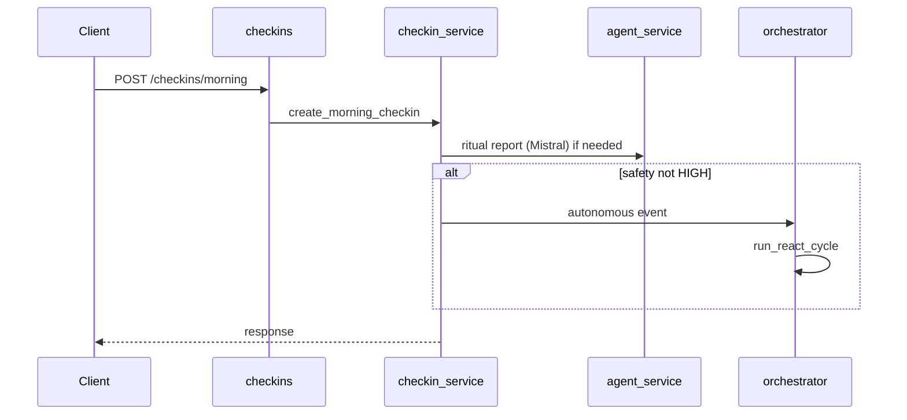

# Mizan — Architecture

Technical overview for reviewers: system context, data model, core flows, and autonomous agent design.

---

## System context

Mizan is a **student wellbeing platform** tied to academic context (schedule, exams, projects). Three clients share one API:

| Client | Stack | Audience |
|--------|--------|----------|
| Web | Next.js 15 (App Router) | School admins + students |
| Mobile | Expo / React Native | Students |
| API | FastAPI, async SQLAlchemy, PostgreSQL | All clients |



External integrations: **Mistral** (LLM, STT, TTS, realtime transcription), **Cloudinary** (media), optional **SMTP** (activation OTP).

---

## AWS deployment (reference)



Production-style demo stack: ECS Fargate (frontend + backend), RDS PostgreSQL, ALB + CloudFront, Secrets Manager, ECR, CloudWatch. See [DEPLOYMENT_README.md](../DEPLOYMENT_README.md) and [infra/aws/README.md](../infra/aws/README.md).

---

## Use cases (high level)



---

## Domain model



### Entity relationships (simplified)

```mermaid
erDiagram
  User ||--o| Student : has
  School ||--o{ User : admins
  School ||--o{ Filiere : has
  Filiere ||--o{ Promotion : has
  Promotion ||--o{ Class : has
  Class ||--o{ Student : enrolls
  Student ||--o{ MorningCheckin : logs
  Student ||--o{ EveningCheckin : logs
  Student ||--o{ Goal : sets
  Goal ||--o{ GoalProgress : tracks
  Student ||--o{ Task : owns
  Student ||--o{ ModeSession : runs
  Student ||--o{ Notification : receives
  Student ||--o{ AgentRun : triggers
  AgentRun ||--o{ AgentDecision : records
  Student ||--o{ AgentActionContract : commits
  Student ||--o{ VoiceSession : uses
  Student ||--o{ Schedule : has
  Student ||--o{ Exam : has
  Student ||--o{ Project : has
```

| Model | Purpose |
|-------|---------|
| `User` | Login; roles `STUDENT` or `ADMIN` |
| `School` → `Filiere` → `Promotion` → `Class` | Institution hierarchy |
| `Student` | Profile (1:1 with `User`) |
| `MorningCheckin` / `EveningCheckin` | Daily rituals; mood, sleep, AI summary |
| `Goal` / `GoalProgress` | Targets and daily progress |
| `Task` | To-dos (`manual`, `agent`, `chat`, …) |
| `ModeSession` | Focus modes (`REVISION`, `EXAMEN`, `PROJET`, …) |
| `Notification` | In-app alerts + WebSocket delivery |
| `AgentRun` / `AgentDecision` | Autonomous agent cycle + outcome |
| `AgentActionContract` | Student accept/decline commitments |
| `VoiceSession` | Guided voice check-in pipeline |

---

## Request flow



**Design rule:** HTTP routes stay thin; business logic lives in `mizan-backend/app/services/`.

---

## Morning check-in sequence





Evening check-in requires a morning check-in the same calendar day.

---

## Autonomous agent

Event-driven (not an always-on chat loop):

| Event | Trigger |
|-------|---------|
| `MORNING_CHECKIN_SUBMITTED` | After morning ritual (if safety allows) |
| `EVENING_CHECKIN_SUBMITTED` | After evening ritual |
| `TEXT_CHAT_MESSAGE` / `VOICE_CHAT_MESSAGE` | After agent chat turn |
| `PERIODIC_SCAN` | Background scheduler (~15 min, per-student rules) |

Each event has an **idempotency key** so duplicate triggers reuse the same `AgentRun`.

Actions include wellbeing nudges, mode switches, resource delivery, task creation, **action contracts** (accept/decline/complete), and escalation paths—with cooldown and deduplication guards.

Context for all AI decisions: `build_agent_context()` in `context_builder.py` (schedule, exams, mood history, open tasks, stress indicators, etc.).

---

## API surface

Base prefix: `/api/v1` · OpenAPI: `/docs`

| Area | Prefix | Notes |
|------|--------|--------|
| Auth | `/auth` | JWT access + refresh, activation |
| Institutional | `/institutional` | Schools, filières, promotions, classes |
| Students | `/students` | Profiles, CSV trombinoscope import |
| Class content | `/class-content` | Schedules, exams, projects + CSV |
| Check-ins | `/checkins` | Morning/evening + history |
| Voice | `/voice` | STT, analysis, realtime WS |
| Agent | `/agent` | Chat, plans, contracts |
| Notifications | `/notifications` | REST + `WS /notifications/ws` |
| Analytics | `/analytics` | Student + admin dashboards |
| Tasks / Goals / Modes | `/tasks`, `/goals`, `/modes` | Student productivity |
| Global | `/global` | Platform admin stats |

Full route list and env vars: [mizan-backend/README.md](../mizan-backend/README.md).
