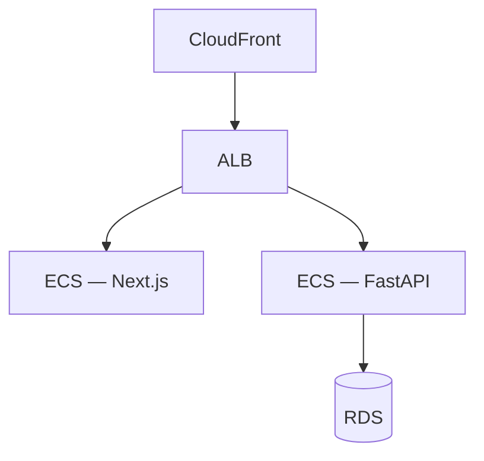

# Mizan — AWS infrastructure (Terraform)

Terraform stack for running Mizan on AWS: **ECS Fargate** (frontend + backend), **RDS PostgreSQL**, **ALB + CloudFront**, **Secrets Manager**, **ECR**, and **CloudWatch**.

Parent guide: [DEPLOYMENT_README.md](../../DEPLOYMENT_README.md)

## Architecture



- **Routing:** ALB sends `/api/v1/*`, `/health`, `/docs`, `/openapi.json` to the backend; other paths to the frontend.
- **Network:** Backend and RDS in private subnets; no NAT gateway in default config (lower cost).
- **Secrets:** Application env injected from Secrets Manager (JWT, Mistral, Cloudinary, SMTP).

## Environments

Resource names use `${project_name}-${environment}` (default project: `mizan`, default environment: `staging`).

| `environment` | Typical use |
|---------------|-------------|
| `staging` | CI default, integration testing |
| `production` | Live pilot |

Use a dedicated Terraform state key per environment, e.g. `mizan/staging/terraform.tfstate`.

## Cost-conscious defaults

- One Fargate task per service
- `db.t4g.micro` RDS, single-AZ
- CloudFront `PriceClass_100`
- ECR force-delete enabled for teardown
- RDS final snapshot skipped by default (override for production)

Adjust via `variables.tf` before production hardening.

## GitHub Actions backend state

Create a versioned S3 bucket, then set repository secrets:

```text
AWS_DEPLOY_ENABLED=true
AWS_ACCESS_KEY_ID=...
AWS_SECRET_ACCESS_KEY=...
AWS_REGION=eu-west-3
TF_STATE_BUCKET=<unique-bucket>
TF_STATE_KEY=mizan/staging/terraform.tfstate
```

Optional: `BACKEND_SECRET_KEY`, `MISTRAL_API_KEY`, `CLOUDINARY_*`, `SMTP_*`, `APP_PUBLIC_URL`.

Deploy: **Actions → CI/CD → deploy**. Destroy: **aws_action: destroy**.

## Local two-phase deploy

The frontend image must be built with the final public URL. Sequence:

1. `terraform apply -target=aws_ecr_repository.backend -target=aws_ecr_repository.frontend`
2. Build and push backend + bootstrap frontend images
3. `terraform apply` with image tags
4. Rebuild frontend with `terraform output -raw app_url` as `NEXT_PUBLIC_API_URL`
5. `terraform apply` again with final frontend tag
6. `aws cloudfront create-invalidation --paths "/*"`

See [DEPLOYMENT_README.md](../../DEPLOYMENT_README.md) for full commands.

## Outputs

After apply:

- `app_url` — CloudFront URL (or custom domain when configured)
- `api_health_url` — `{app_url}/health`
- `cloudfront_distribution_id` — for cache invalidation
- ECR repository URLs — for manual image pushes

## Destroy

```bash
cd infra/aws
terraform destroy
```

Removes ECS, RDS, ALB, CloudFront, secrets, and related resources for the current state file. Allow time for CloudFront distribution deletion.
