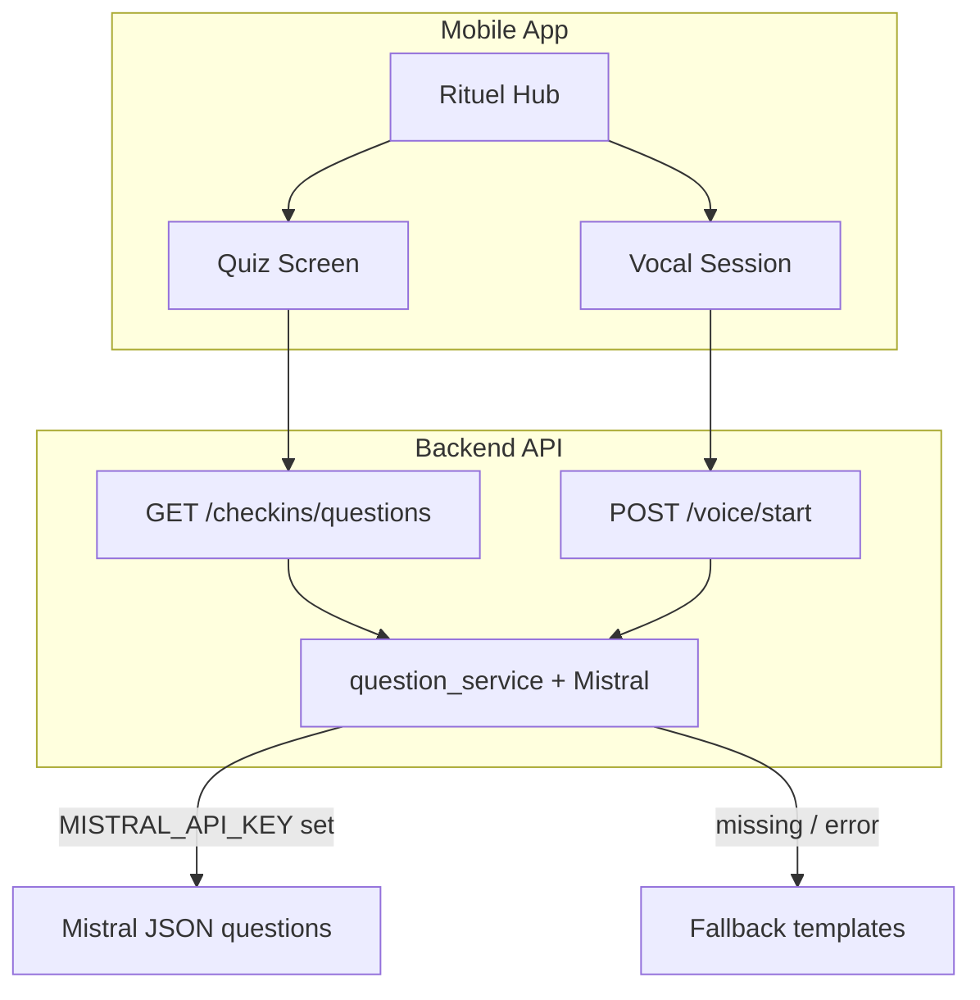

# Mizan Mobile — Student App Improvement Plan

This document tracks how to connect **LLM-personalized check-ins**, fix **notification WebSocket noise**, and evolve the app from a **web-like layout** to a **native mobile UX**.

Last updated: May 2026

---

## Current state (summary)

### Check-in questions are not hardcoded in the app

The mobile client already calls the same backend endpoints as the web app:

| Flow | Mobile API | Backend |
|------|------------|---------|
| Quiz (morning / evening) | `GET /checkins/questions?period=&mode=qcm` | `generate_personalized_questions()` |
| Voice ritual | `POST /voice/start` | Same generator (`mode=voice`) + TTS |

Generic lines such as *"How are you feeling right now?"* come from the backend **fallback** in `mizan-backend/app/services/question_service.py` when:

1. **`MISTRAL_API_KEY` is empty** in `mizan-backend/.env` (loaded via Docker `env_file`; not overridden in root `docker-compose.yml`), or
2. **Mistral call fails** — errors are swallowed (`except Exception: return fallback`) with no client-visible flag, or
3. **LLM JSON fails validation** → fallback again.

Logs may show `POST /agent/plan` succeeding while **`GET /checkins/questions`** or **`POST /voice/start`** never run if the user has not opened quiz/vocal flows yet.

### Mobile QCM UI under-renders LLM output

Web check-in pages support `scale`, `multi_choice`, `time_hours`, `number`, etc.  
Mobile `QuestionForm.tsx` only handles `single_choice`, `boolean`, and a text `Field` for everything else — so personalized questions can look static or broken even when the API returns rich data.

### Notification WebSocket errors are mostly cosmetic

`WebSocketDisconnect` / `ClientDisconnected` on `/api/v1/notifications/ws` usually means:

- The client closes the socket (navigation, reload, Expo hot reload) before the server sends `notification.snapshot`.
- The backend does not catch disconnect on `send_json` → noisy traceback in logs.
- Mobile **polls** notifications every 30s **and** reconnects WebSocket every 5s → duplicate traffic, not a functional blocker for check-ins.

---

## Target architecture



---

## Phase 1 — Confirm LLM for check-ins

**Goal:** Know whether questions are personalized or fallback.  
**Effort:** ~1–2 hours

### Tasks

1. **Configuration**
   - Set `MISTRAL_API_KEY` in `mizan-backend/.env`.
   - Restart: `docker compose restart backend`.
   - Verify (length only): `docker compose exec backend printenv MISTRAL_API_KEY`.

2. **Smoke tests** (Bearer token from mobile login)
   - `GET /api/v1/checkins/questions?period=MORNING&mode=qcm`
   - `POST /api/v1/voice/start` with body `{ "period": "MORNING" }`
   - Expect texts that reference **today’s schedule / exams**, not the same 3–4 generic templates every time.

3. **Backend observability** (`question_service.py`)
   - Log fallback reason: `no_key`, `mistral_error`, `invalid_json`.
   - Optional response field: `source: "llm" | "fallback"` on `PersonalizedCheckinQuestionsResponse` and voice session metadata.

4. **Language**
   - LLM prompts currently request **English** questions; student UI is **French**.
   - **Decision:** French prompts for student-facing flows (recommended), or accept EN questions with FR chrome.

### Acceptance criteria

- [ ] API returns different question sets when schedule/exams context changes.
- [ ] Logs or `source` field confirms `llm` when key is set.
- [ ] Vocal `audio_base64` present when TTS is configured.

---

## Phase 2 — Mobile check-in parity with web

**Goal:** Same LLM contract and input types as web.  
**Effort:** ~2–3 days

| Task | Detail |
|------|--------|
| **Shared `QuestionForm`** | Port web input rendering: `scale` (1–10 pills), `multi_choice`, `time_hours`, `number`, `text` |
| **Loading / errors** | Skeleton while `checkinsApi.questions` loads; retry banner on failure |
| **Voice session** | Surface `voice/start` errors; hint when TTS audio is missing |
| **Hub data** | Optionally combine `analyticsApi.dashboard()` with briefing for check-in flags aligned with web |
| **Morning / evening forms** | Align static fields (sleep, mood, mode) vs dynamic QCM with web (avoid duplicate data entry) |

### Key files

- `src/screens/student/checkin/QuestionForm.tsx`
- `src/screens/student/checkin/MorningCheckinScreen.tsx`
- `src/screens/student/checkin/EveningCheckinScreen.tsx`
- `src/screens/student/checkin/VoiceCheckinScreen.tsx`
- Reference: `mizan-frontend/app/(main)/checkin/morning/page.tsx`, `evening/page.tsx`

### Acceptance criteria

- [ ] Quiz shows variable LLM questions with correct controls per `answer_type`.
- [ ] Vocal session plays question audio when backend provides `audio_base64`.
- [ ] User sees clear message when backend uses fallback.

---

## Phase 3 — Notifications WebSocket hygiene

**Goal:** Clean logs and stable mobile connection.  
**Effort:** ~half day

### Backend (`mizan-backend/app/api/v1/routes/notifications.py`)

- Wrap `websocket.send_json` in `try/except WebSocketDisconnect`.
- Treat client disconnect as normal; avoid stack traces in uvicorn logs.

### Mobile (`src/navigation/AppNavigator.tsx`)

- Prefer **one strategy**: WebSocket **or** polling (e.g. poll every 60s), not aggressive WS reconnect every 5s plus 30s poll.
- On `AppState` background: close WS; on foreground: single reconnect.
- Handle message types: `notification.snapshot`, `notification.all_read`, not only ad-hoc `title` payloads.

### Acceptance criteria

- [ ] No ERROR traceback when user leaves app during WS handshake.
- [ ] Unread badge still updates reliably on device.

---

## Phase 4 — Native mobile UX (not “web in React Native”)

**Goal:** Student app that feels mobile-first.  
**Effort:** ~1–2 weeks

### Principles

- One primary action per screen; large tap targets; bottom-aligned CTAs where appropriate.
- Less admin-dashboard density; more ritual → action narrative.
- Native patterns: bottom sheet (format picker), segmented controls, haptics on record stop.
- Consistent typography from `src/theme.ts`; reduce heavy “marketing card” stacking.
- **French** copy for students; LLM output in French (depends on Phase 1).

### Screen direction

| Screen | Direction |
|--------|-----------|
| **Rituel hub** | Large morning/evening cards with live countdown; vocal as primary CTA; simplify hero metrics |
| **Format picker** | Bottom sheet instead of inline card grid |
| **QCM** | Step wizard (one question or one section per step) |
| **Vocal** | Keep chat-style session; clearer “Mizan speaks / your turn” states |
| **Mizan AI** | Full-screen chat; hands-free in header; hide text field when hands-free is on |
| **Tabs** | Simpler tab bar; less web-like shadows on every block |

### Tech cleanup (supports UX)

- Remove duplicate mega-import blocks left from `MainScreens.tsx` split.
- Split `src/screens/student/styles.ts` by domain (`checkin.styles.ts`, `chat.styles.ts`, …).
- Extract hooks: `useCheckinQuestions`, `useVoiceSession`, `useCheckinWindows`.

### Acceptance criteria

- [ ] Design review: screens identifiable as native ritual flow, not shrunken web pages.
- [ ] No regression on check-in completion and task creation from LLM plans.

---

## Phase 5 — Advanced parity (optional)

Lower priority until Phases 1–2 are green.

| Feature | Web reference |
|---------|----------------|
| Realtime voice WS | `/voice/realtime`, `VoiceCompanion` |
| Post-check-in countdown | `NextCheckinCountdown` component |
| Selective task creation from vocal | Checkbox recommendations on voice result |

---

## Sprint order

| Sprint | Deliverable |
|--------|-------------|
| **A** | Mistral verified + backend logging + `source` flag |
| **B** | Mobile `QuestionForm` parity + load/error states |
| **C** | WebSocket fix + reduced polling |
| **D** | Native UX pass (hub, QCM wizard, vocal polish) |
| **E** | Optional realtime voice + advanced task UX |

---

## Quick diagnostics

1. Open **Matin → Quiz dynamique** and watch backend for:  
   `GET /api/v1/checkins/questions?period=MORNING&mode=qcm`

2. If responses always use IDs like `voice_state`, `voice_sleep` → **fallback** → fix `MISTRAL_API_KEY`.

3. If questions vary in API but UI looks wrong → **Phase 2** (`QuestionForm`).

4. WS tracebacks on tab switch → **Phase 3** (safe to defer for check-in work).

---

## Related code paths

| Area | Path |
|------|------|
| Question generation | `mizan-backend/app/services/question_service.py` |
| Voice session start | `mizan-backend/app/services/voice_service.py` |
| Check-in routes | `mizan-backend/app/api/v1/routes/checkins.py` |
| Mobile API client | `mizan-mobile-app/src/lib/api.ts` |
| Mobile check-in screens | `mizan-mobile-app/src/screens/student/checkin/` |
| Web check-in reference | `mizan-frontend/app/(main)/checkin/` |
| Notification WS | `mizan-backend/app/api/v1/routes/notifications.py` |
| Mobile WS + poll | `mizan-mobile-app/src/navigation/AppNavigator.tsx` |

---

## Mobile project structure (after refactor)

```
mizan-mobile-app/src/screens/student/
├── index.ts              # barrel exports
├── styles.ts             # shared styles (candidate to split)
├── checkin/              # hub, morning, evening, voice, QuestionForm
├── agent/                # Mizan AI chat
├── components/           # VoiceOrb, RitualFormatPicker, …
├── hooks/                # useLoader, useLiveNow
└── …                     # dashboard, tasks, goals, …
```

Legacy re-exports: `src/screens/MainScreens.tsx` → `./student`.
